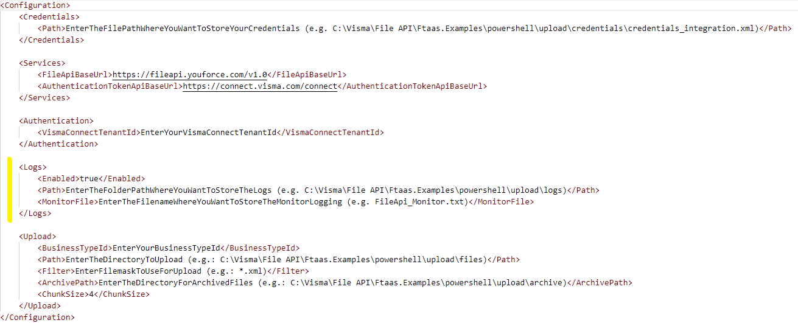
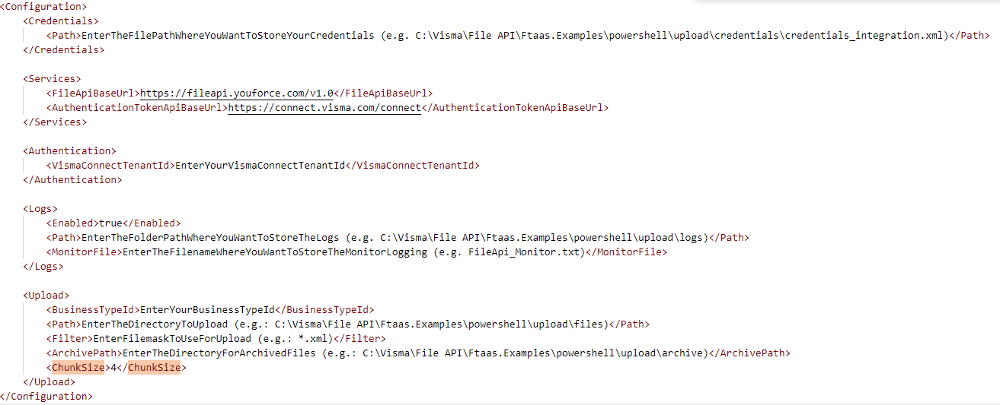

# PowerShell update 2025-03 version 1.25

1. Fix an issue downloading files by chunks.
2. Improve retry mechanism downloading files to retry 499 errors.
3. Increase Chunk Size limit to 1GB.

# PowerShell update 2024-03 version 1.24

Fix an issue where the upload examples were creating the log files with a wrong name.

# PowerShell update 2024-03 version 1.23

1. Include the monitor file in the upload examples (it was already in place in the download examples).
2. Ensure the removal of all the temporary files created by the examples.
3. Fix an issue where the amount of files to upload was shown incorrectly when only one file was available to upload.

The monitor file is a single file that will contain the minimum of records needed to determine if the script runs successfully and errors can be easily detected.  
This file is suitable for checking regularly by an automated error checking process.  

# PowerShell update 2024-02 version 1.22

1. Update the READMEs to show the minimal .NET version required (4.8).
2. Improve the download process.
3. Force the usage of TLS 1.2 in the upload script (in the download one it was already forced).
4. Show the script, PowerShell, Windows and .NET versions in the logs.

# PowerShell update 2023-10

Fix an issue when the logger configuration is invalid, the script finishes the execution with an error.

# PowerShell update 2023-08

New functionality and improvements in PowerShell Examples.

1. Support for logfiles.
2. Upload by chunks extends upload file size limit from 100 MB to 10 GB.
3. Download by chunks extends download file size limit from 2 GB to 10 GB.
4. Improved reliability.
5. Added default Proxy settings detection.
6. Added comments.

## Configure logs in upload and download examples

A new section has been added in the configuration of the examples to configure the logs.

Please follow the steps below to activate the logs:

1. Download the latest version of Powershell examples [here](https://github.com/VR-API-Integration/file-api-integration-examples).
2. Edit the configuration settings: **'Logs'** - **'Enabled'** with the value **'true'**.
3. Edit the configuration settings: **'Logs'** - **'Path'** with the local folder where to store the detailed logs.
4. Edit the configuration settings: **'Logs'** - **'MonitorFile'** with the filename where you want to store the monitor logs. The MonitorFile is stored along the detailed logs.

For the detailed logs a new file will be created every day.  
The monitor file is a single file that will contain the minimum of records needed to determine if the script runs successfully and errors can be easily detected.  
This file is suitable for checking regularly by an automated error checking process.  
The detailed logfile can provide more information about the possible cause of errors.  

See additional details in the Readme of PowerShell examples  
[Readme Upload example](https://github.com/VR-API-Integration/file-api-integration-examples/blob/main/powershell/upload/README.md)  
[Readme Download example](https://github.com/VR-API-Integration/file-api-integration-examples/blob/main/powershell/download/README.md)   

## Improve the upload example to upload files by chunks 

Improvements have been made in the upload example to upload files by chunks.  
With this new functionality, the file size limit for uploading files has been extended from 100MB to 10GB.  
A new field (`<ChunkSize>`)has been added in the configuration of the example to define the chunk size (MB).  
Recommended chunk size for uploads is 4MB.

Please follow the steps below to upload files by chunks:

1. Download the last version of PowerShell examples [here](https://github.com/VR-API-Integration/file-api-integration-examples).
2. Edit the configuration settings: **'Upload'** - **'ChunkSize'** with the value **'4'**.

See additional details in the [Readme](https://github.com/VR-API-Integration/file-api-integration-examples/blob/main/powershell/upload/README.md) of powershell upload example.

## Improve the download example to download files by chunks

Improvements have been made in the download example to download files by chunks.  
With this new functionality, the file size limit for downloading files has been extended from 2 GB to 10 GB.  
A new field (`<ChunkSize>`) has been added in the configuration of the example to define the chunk size (MB).  
Recommended chunk size for downloads is 100 MB  

Please follow the below steps to download the files by chunks:

1. Download the last version of PowerShell examples [here](https://github.com/VR-API-Integration/file-api-integration-examples) .
2. Edit the configuration settings: **'Download'** - **'ChunkSize'** with the value **'100'**.

See additional details in the [Readme](https://github.com/VR-API-Integration/file-api-integration-examples/blob/main/powershell/download/README.md) of the powershell example.

## Reliability

Improvements have been made in the reliability of the scripts by implementing a retry mechanism for every upload and download request.  
Also the spike arrest feature (max #requests/min) is detected and handled.

## Proxy Settings

Added code to detect and use the default proxy settings in the scripts.

## Comments

Comments have been added to the scripts to make the code/functionality more understandable for developers.

